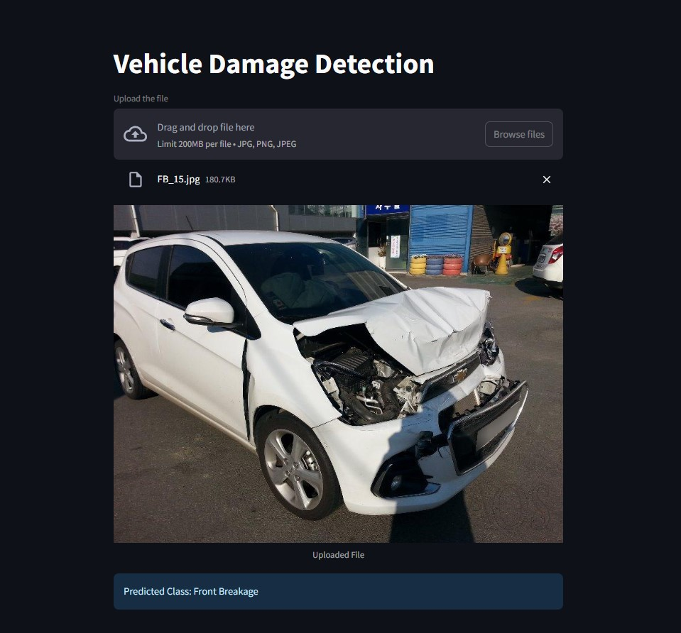

# 🚗 Vehicle Damage Detection App

A deep learning web application that detects vehicle damage from car images. Upload an image of a vehicle, and the model will classify the type of damage present.

## 📌 Features

- Upload vehicle images through a simple web interface
- Detects different types of vehicle damage
- Built using Streamlit and TensorFlow/Keras
- Uses Transfer Learning with ResNet50

## 🖼️ Application Preview



## 🧠 Model Details

- Architecture: ResNet50 (Transfer Learning)
- Training Images: 1700 images
- Validation Accuracy: 80%
- Framework: TensorFlow / Keras

### Target Classes

1. Front Normal
2. Front Crushed
3. Front Breakage
4. Rear Normal
5. Rear Crushed
6. Rear Breakage

## 📷 Image Requirements

For best results:

- Upload clear images of vehicles
- The car should be captured from:
  - Front Three-Quarter View, or
  - Rear Three-Quarter View
- Ensure good lighting conditions

## 🛠️ Installation

Clone the repository:

```bash
git clone https://github.com/Aayush2144/car-damage-detection.git
cd car-damage-detection
```

Install dependencies:

```bash
pip install -r requirements.txt
```

## ▶️ Run the Application

Start the Streamlit app:

```bash
streamlit run app.py
```

Then open the local URL displayed in your terminal (usually `http://localhost:8501`).

## 📂 Project Structure

```text
car-damage-detection/
│
├── model/
├── app.py
├── model_helper.py
├── requirements.txt
├── README.md
├── damage_prediction.ipynb
├── hyperparameter_tunning.ipynb
└── app_screenshot.jpg
```

## 🚀 Future Improvements

- Increase dataset size for better accuracy
- Add side-view damage detection
- Deploy the application online
- Improve model performance with advanced architectures

## 📜 License

This project is for educational and research purposes.
