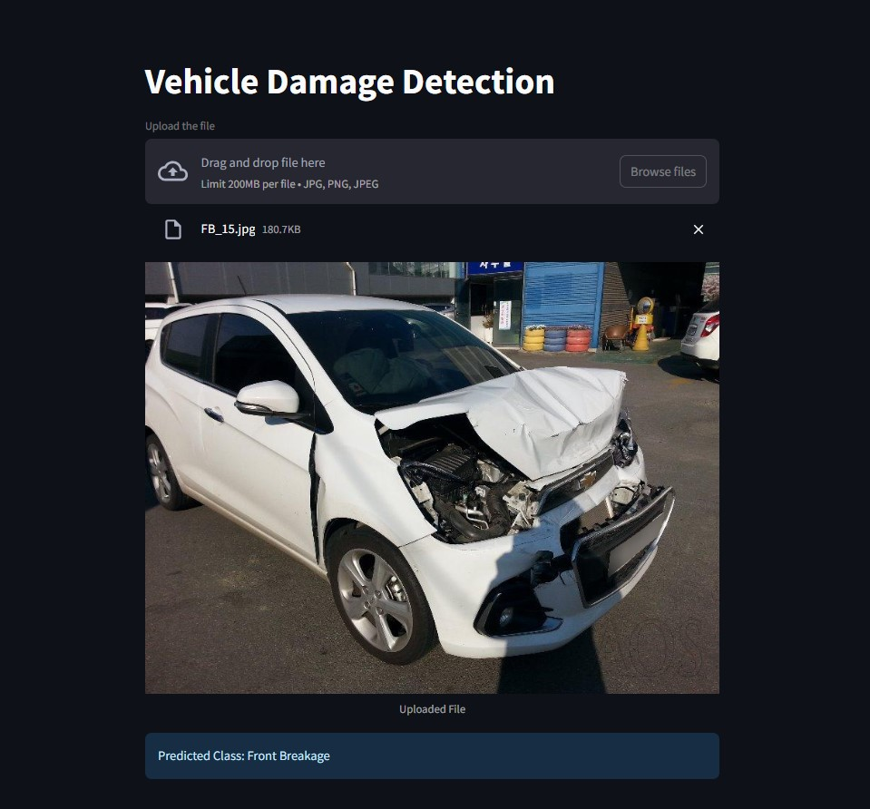
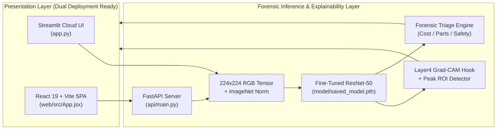

# CrashSite v2.0 — Forensic Vehicle Damage Detection AI

An explainable deep-learning vehicle damage inspection system powered by a fine-tuned **ResNet-50 CNN** and real-time **Layer4 Grad-CAM** spatial attention mapping. Drop any front or rear three-quarter vehicle photo to get an instant forensic damage assessment — including severity tier, HUD impact reticle, component checklist, driveability status, and repair cost estimate.



---

## System Architecture


```mermaid
flowchart LR
    subgraph Client["Presentation Layer (Dual Deployment Ready)"]
        UI_ST["Streamlit Cloud UI\n(app.py)"]
        UI_WEB["React 19 + Vite SPA\n(web/src/App.jsx)"]
    end

    subgraph Engine["Forensic Inference & Explainability Layer"]
        API["FastAPI Server\n(api/main.py)"]
        PREP["224x224 RGB Tensor\n+ ImageNet Norm"]
        RN50["Fine-Tuned ResNet-50\n(model/saved_model.pth)"]
        GCAM["Layer4 Grad-CAM Hook\n+ Peak ROI Detector"]
        DIAG["Forensic Triage Engine\n(Cost / Parts / Safety)"]
    end

    UI_ST --> PREP
    UI_WEB --> API --> PREP
    PREP --> RN50
    RN50 --> GCAM
    RN50 --> DIAG
    GCAM --> Client
    DIAG --> Client
```

---

## Key Features

- **6-Class Damage Classification**:
  - `Front Crushed` (Severe) · `Front Breakage` (Moderate) · `Front Normal` (Undamaged)
  - `Rear Crushed` (Severe) · `Rear Breakage` (Moderate) · `Rear Normal` (Undamaged)
- **Explainable AI (Grad-CAM + Target Reticle HUD)**:
  - Backpropagates into the final `layer4` residual block to generate a live thermal attention overlay and peak impact bounding box (`PEAK ROI`).
- **Forensic Diagnostic Dossier**:
  - Top-down **Vehicle Blueprint Schematic SVG** with dynamic zone highlighting.
  - **Driveability Safety Rating**, **Estimated Repair Cost & Labor Hours**, and **4-Point Component Checklist**.
  - **6-Class Softmax Certainty Breakdown** + **Front vs. Rear** & **Damaged vs. Intact** split meters.
  - One-click **JSON Telemetry Export** & **Session Inspection Log**.
- **Bundled Validation Test Deck (`samples/`)**:
  - Includes 18 curated validation frames across all 6 classes so visitors can test the model with one click on **Streamlit Cloud** without uploading the full 1,700-image training dataset.

---

## Repository Structure

```text
├── .streamlit/
│   └── config.toml            # Dark CrashSite theme configuration for Streamlit Cloud
├── api/                       # FastAPI REST backend & static SPA server
│   ├── main.py                # /predict, /sample/{view}, /health endpoints
│   └── model_helper.py        # FastAPI Grad-CAM & ResNet-50 inference engine
├── web/                       # React 19 + Vite Frontend (CrashSite Forensic SPA)
│   ├── index.html
│   ├── package.json
│   ├── vite.config.js
│   └── src/
│       ├── App.jsx            # Interactive forensic workbench, schematic & tabs
│       ├── main.jsx
│       └── styles.css         # CrashSite industrial dark theme
├── model/
│   └── saved_model.pth        # Trained PyTorch ResNet-50 state dictionary
├── samples/                   # 18 curated sample images (3 per class) for cloud demo
│   ├── F_Breakage/
│   ├── F_Crushed/
│   ├── F_Normal/
│   ├── R_Breakage/
│   ├── R_Crushed/
│   └── R_Normal/
├── notebooks/                 # Model training & Optuna hyperparameter tuning notebooks
│   ├── damage_prediction.ipynb
│   └── hyperparameter_tunning.ipynb
├── app.py                     # Streamlit Cloud entrypoint (CrashSite Forensic v2.0 UI)
├── model_helper.py            # Shared cross-platform PyTorch + Grad-CAM + HUD helper
├── requirements.txt           # Cloud-compatible Python dependencies
├── Dockerfile                 # Multi-stage Docker build (React SPA + FastAPI)
└── render.yaml                # Render.com cloud deployment blueprint
```

---

## Deployment Guide

### Option 1: Deploy on Streamlit Cloud (Recommended / Zero-Config)
1. Push this repository to GitHub.
2. Go to [share.streamlit.io](https://share.streamlit.io/) and connect your GitHub repository.
3. Set **Main file path** to `app.py`.
4. Click **Deploy!** Streamlit Cloud will automatically install `requirements.txt`, apply `.streamlit/config.toml`, load `model/saved_model.pth` on CPU, and enable the 6-class sample deck from `samples/`.

### Option 2: Deploy Full-Stack React + FastAPI (Render / Railway / Docker)
```bash
docker build -t crashsite-ai .
docker run -p 8000:8000 crashsite-ai
```
Then open `http://localhost:8000`.

---

## Local Development

### Run Streamlit UI
```bash
pip install -r requirements.txt
streamlit run app.py
```

### Run React + FastAPI Full-Stack UI
```bash
# Terminal 1 — Start FastAPI Engine on port 8000
uvicorn main:app --app-dir api --host 127.0.0.1 --port 8000

# Terminal 2 — Start React Vite Dev Server on port 5174
cd web && npm install && npm run dev
```
